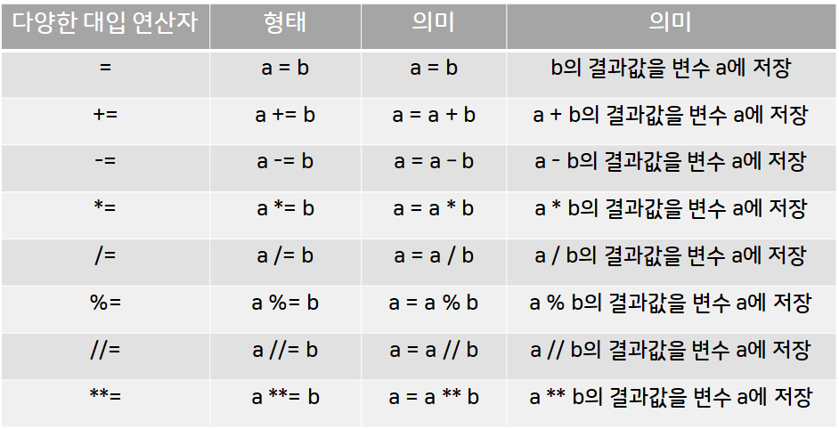

# 기초

## 문자열과 수

-   자료의 종류와 문자열 표현

    문자가 모인 단어나 문장 또는 단락 등을 문자열(string)이라고 한다. 따옴표로 둘러싸면 모두 문자열 취급한다.

    ```python
    >>>print("Hello World!")
    Hello World!
    >>>print('Hello Python!')
    Hello Python!
    ```

    작은 따옴표와 큰 따옴표 모두 사용가능하지만 앞뒤를 동일하게 사용하여야 한다.

-   문자열 연산자 `+`,`*`와 주석처리

    문자열을 연결하고 싶다면 연결연산자 `+`를 사용, 문자열을 반복하고 싶다면 반복연산자 `*`를 사용한다.

    ```python
    >>>print("Hello" 'World')
    HelloWorld
    >>>print("Hello" + "World")
    HelloWorld
    ```

    ```python
    >>>print("hey " * 3)
    hey hey hey
    >>>print(3 * "hey ")
    hey hey hey
    ```

    `*`는 앞뒤의 자료는 순서와 상관없이 각각 문자열과 정수이면 반복을 수행하며, 수의 연산과 같이 연산자 `+`보다 먼저 수행한다.

    여러 줄에 걸쳐 문자열을 처리하기 위해 삼중 따옴표 `"""`, `'''` 를 사용한다.

    ```python
    >>>print('''String operatort + and * are
    very easy!''')
    String operatort + and * are
    very easy!
    ```

    ```python
    '''comments.py
        studing python'''
    print('# 이후는 주석') # 한 줄에서 문장 이후에도 주석 사용 가능
    print('string: "python"') # 작은따옴표 내부에서 큰따옴표는 문자열
    print("numner: 3.14") # 문자열 내부에서 숫자도 문자열
    print("string: 'python'") # 큰따옴표 내부에서 작은따옴표는 문자열
    ```

    파이썬 주석은 `#`으로 시작하고 그 줄의 끝까지 유효하다.

    여러줄 주석 처리를 위해 삼중따옴표나 줄마다 `#`을 넣어 사용한다.

-   정수와 실수

    숫자는 정수(integer)와 실수(real 또는 float)로 나눈다.

    ```python
    >>>15
    15
    >>>0
    0
    >>>000
    0
    >>>003.14 # 정수 앞 0은 불가능
    3.14
    ```

    정수와 실수는 문자 `e`나 `E`를 통해 거듭제곱으로 표현할 수 있다.

    ```python
    >>> 2.7834e4
    27834.0
    >>> 2.7834E4
    27834.0
    >>> 2.7834e-4
    0.00027834
    >>> 2.7834E-4
    0.00027834
    >>> 3543e-4
    0.3543
    >>> 3543E4
    35430000.0
    ```

-   정수와 실수의 연산

    더하기(addition) `+`, 빼기(subtraction) `-`, 곱하기(multiplication) `*`, 나누기(division) `/` 연산자

    ```python
    >>> 5 + 3
    8
    >>> 5 - 3
    2
    >>> 5 * 3
    15
    >>> 5 / 3 # 결과는 항상 실수이기 때문에 0으로 나누면 오류 발생
    1.6666666666666667
    ```

    정수 나눗셈(floor division) `//`, 나머지(modulus, modulo) `%`, 거듭제곱(exponentiation) `**` 연산자

    ```python
    >>> 5 // 3 # 결과는 나누기 결과를 넘지 않는 가장 작은 정수 부분
    1
    >>> 5 % 3
    2
    >>> 5 ** 3
    125
    ```

    -   연산자의 우선순위

        괄호 → 지수 `**` → 부호 `+`,`-` → `*`,`/`,`//`,`%` → 가감 `+`,`-`

        거듭제곱`**`은 오른쪽에서 왼쪽, 나머지 연산자는 왼쪽에서 오른쪽으로 계산한다.

    대화형 모드에서 마지막에 실행된 결과값은 `_`에 대입된다.

    ```python
    >>> 60
    60
    >>> _
    60
    >>> 3 * _
    180
    >>> _
    180
    ```

-   함수 `print()`

    출력에 이용되는 함수이다. 콤마 `,` 로 구분해 여러 자료를 출력할 수 있다.

    ```python
    >>> print('Hi','there',':)')
    Hi there :)
    ```

-   함수 `eval()`

    실행 가능한 연산식 문자열인 expression을 실행한 결과를 반환한다.

    ```python
    >>> eval('3 + 15 / 2')
    10.5
    >>> eval('4 * 3 % 5')
    2
    >>> eval('3 * -2 ** 3')
    -24
    >>> eval('"python " * 3')
    'python python python'
    >>> eval("'python ' * 3")
    'python python python '
    ```

---

## 변수와 키워드, 대입 연산자

-   자료형과 `type()` 함수

    정수는 `int`, 실수는 `float`, 문자열은 `str` 로 사용한다.

    ```python
    >>> type(3)
    <class 'int'>
    >>> pi = 3.14
    >>> type(pi)
    <class 'float'>
    >>> type('python')
    <class 'str'>
    >>> type(3 + 4j) # 복소수
    <class 'complex'>
    ```

-   변수와 대입연산자

    -   변수(variable)

        변하는 자료를 저장하는 메모리 공간이다.

        변수 이름은 저장 값에 의미 있는 이름을 붙일 것!

        대소문자의 영문자와 숫자 그리고 \_로 구성되며, 대소문자는 구별된다.

        숫자는 맨 앞에 올 수 없고, 키워드는 사용할 수 없다.

    변수를 저장하기 위해서 대입연산자 `=` 을 사용한다.

    ```python
    >>> number = 4 # 오른쪽 값을 왼쪽 변수에 저장
    >>> 4 = number # 왼쪽에는 반드시 저장 공간인 변수가 와야 함
    SyntaxError: cannot assign to literal
    ```

    -   대입 연산자

        

    변수는 마지막에 저장된 하나의 값만 기억한다.

    ```python
    >>> a = b = c = 10
    >>> print(a)
    10
    >>> print(b)
    10
    >>> print(c)
    10
    >>> b = 100
    >>> print(b)
    100
    ```

    -   키워드

        이미 예약된 단어(reserved words)

        ```python
        >>> import keyword
        >>> print(keyword.kwlist)
        ['False', 'None', 'True', '__peg_parser__', 'and', 'as', 'assert', 'async', 'await', 'break', 'class', 'continue', 'def', 'del', 'elif', 'else', 'except', 'finally', 'for', 'from', 'global', 'if', 'import', 'in', 'is', 'lambda', 'nonlocal', 'not', 'or', 'pass', 'raise', 'return', 'try', 'while', 'with', 'yield']
        ```

-   한 번에 여러 자료 대입

    콤마로 구분된 여러 변수에 순서대로 값을 대입할 수 있다.

    ```python
    # 두 변수에 저장된 값을 교환(swap)하는 코드
    >>> a, b = 5, 9
    >>> b, a = a, b
    >>> print(a, b)
    9 5
    ```

    다른 언어보다 좀 더 직관적으로 사용할 수 있다.

    ```python
    # 일반적인 예시
    >>> a, b = 5, 9
    >>> temp = a
    >>> a = b
    >>> b = temp
    >>> print(a, b)
    9 5
    ```

-   함수 `divmod()`

    함수 `divmod()`는 나누기 몫 연산 `//`와 나머지 연산 `%`를 함께 수행해 2개의 결과를 반환한다.

    ```python
    >>> 28 // 3, 28 % 3 # 연산식도 대입 연산자와 같이 콤마(,)로 구분해 여러 개 사용 가능
    (9, 1)
    >>> divmod(28, 3)
    (9, 1)
    >>>
    >>> a, b = 17, 5
    >>> d, m = divmod(a, b)
    >>> print(d, m)
    3 2
    ```

---

## 자료의 표준 입력과 자료 변환 함수

-   함수 `input()`

    함수 `input()`은 입력되는 표준 입력을 문자열로 읽어 반환하는 함수이다.

    ```python
    >>> input()
    hey # enter키를 눌러야 진행
    'hey'
    >>> hi = input() # 반환되는 입력 문자열을 변수에 저장
    hello:)
    >>> print(hi)
    hello:)
    ```

    `input('Q?')` 꼴을 사용하여 `Q?`를 콘솔에 출력된 이후에 표준 입력 문자열을 입력받을 수 있다.

    ```python
    >>> height = input('키 :')
    키 : 170 # 키 : 이후 사용자가 입력
    >>> print(height)
     170
    ```

-   자료 변환 함수 `str()`, `int()`, `float()`

    -   `str()`

        정수와 실수를 문자열로 변환하는 데 사용한다.

        ```python
        >>> str(365)
        '365'
        >>> str(3.141592)
        '3.141592'
        >>> days = str(365)
        >>> type(days)
        <class 'str'>
        >>> pi = str(3.141592)
        >>> type(pi)
        <class 'str'>
        ```

    -   `int()`

        정수 형태의 문자열과 실수를 정수로 변환하는 데 사용한다.

        ```python
        >>> int(3.141592)
        3
        >>> int('365')
        365
        >>> pi = int(3.141592)
        >>> type(pi)
        <class 'int'>
        >>> days = int('365')
        >>> type(days)
        <class 'int'>
        ```

        `int('strnum', 10)`은 10진수 형태의 문자열을 10진수 정수로 변환한다.

        여러 진수 형태 문자열을 10진수로 바꾸려면 `int('strnum', n)`을 사용한다.

        ```python
        >>> int('17', 10), int('25', 10) # 10진수 형태의 문자열을 10진수 정수로
        (17, 25)
        >>> int('11', 2), int('1010', 2) # 2진수 형태의 문자열을 10진수 정수로
        (3, 10)
        >>> int('10', 8), int('42', 8) # 8진수 형태의 문자열을 10진수 정수로
        (8, 34)
        >>> int('1A', 16), int('EF', 16) # 16진수 형태의 문자열을 10진수 정수로
        (26, 239)
        ```

        `int('strnum', 0)`을 사용하면 문자열의 첫 부분(`0b`, `0o`, `0x`)을 자동으로 인식하여 10진수로 변환한다.

        ```python
        >>> int('0b11', 0) # 2진수로 자동 인식
        3
        >>> int('0o11', 0) # 8진수로 자동 인식
        9
        >>> int('0x11', 0) # 16진수로 자동 인식
        17
        ```

    -   `float()`

        실수 형태의 문자열과 정수를 실수로 변환하는 데 사용한다.

        ```python
        >>> float(365)
        365.0
        >>> float('3.141592')
        3.141592
        >>> days = float(365)
        >>> type(days)
        <class 'float'>
        >>> pi = float('3.141592')
        >>> type(pi)
        <class 'float'>
        ```

    문자열이 정수나 실수 형태가 아니라면 오류 발생!

-   16진수, 10진수, 8진수, 2진수

    -   16진수(hexadecimal)

        `0x`(숫자 0과 알파벳 x)로시작

        ```python
        >>> 0x1e, 0X1E, 0X1e
        (30, 30, 30)
        ```

    -   8진수(octal)

        `0o`(숫자 0과 알파벳 o)로 시작

        ```python
        >>> 0o17, 0O17
        (15, 15)
        ```

    -   2진수(binary)

        `0b`(숫자 0과 알파벳 b)로 시작

        ```python
        >>> 0b11, 0B11
        (3, 3)
        ```

    각각의 진수를 표시하는 알파벳은 대소문자 모두 가능하다.

-   10진수의 변환 함수 `bin()`, `oct()`, `hex()`

    10진수 → 2진수 : `bin()`

    10진수 → 8진수 : `oct()`

    10진수 → 16진수 : `hex()`

    ```python
    >>> bin(7), bin(16), bin(20)
    ('0b111', '0b10000', '0b10100')
    >>> oct(7), oct(16), oct(20)
    ('0o7', '0o20', '0o24')
    >>> hex(7), hex(16), hex(20)
    ('0x7', '0x10', '0x14')
    ```
